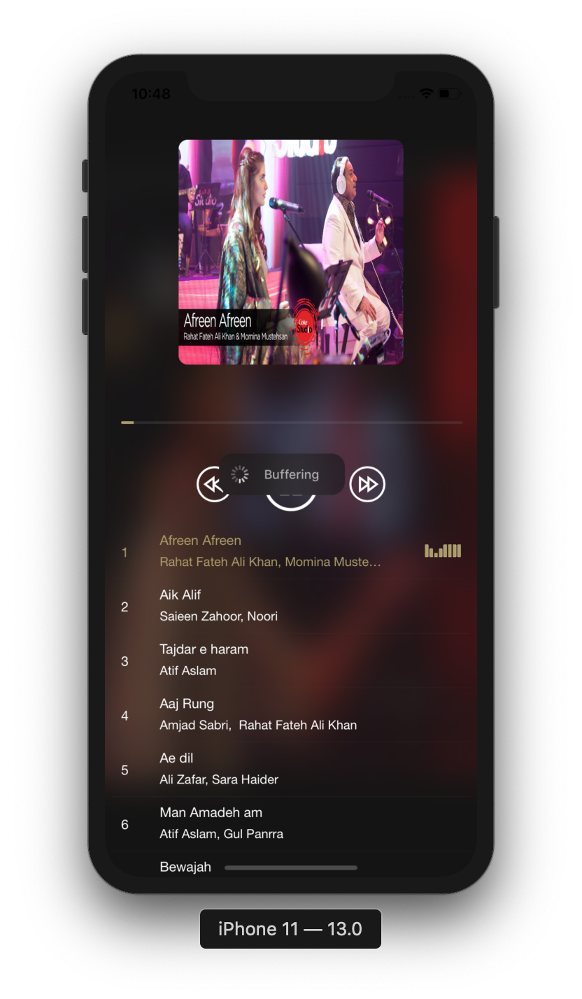
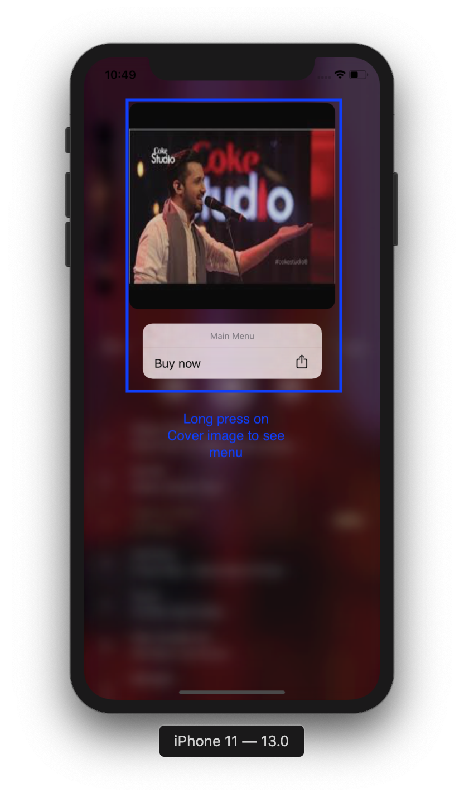
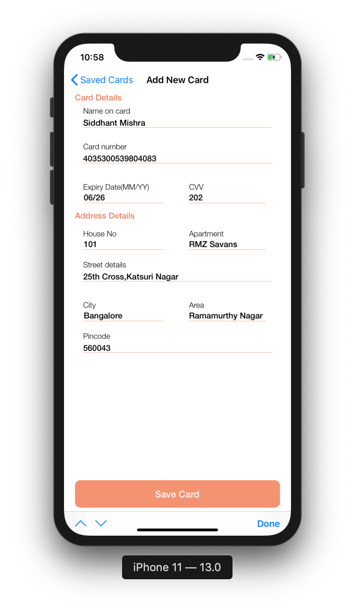

# MusicPlayer-iOS
A music player app that streams songs online.

# Screenshots

1. Launch Screen  
 

2. Music player is ready to play  
 

3. Player controls 
 

4. Swipe cover and tap to play the song   
 

5. Long press cover imae to see menu  
 

6. Add new card  
 

7. Saved Cards  
 

<h3>TODO:</h3>
1.Payment Gateway Integration 
2.Create Playlist option 

<h3>Libraries used </h3>
1.Alamofire Object mapper 
2.FSPagerView 
3.IQKeyboardManagerSwift 
